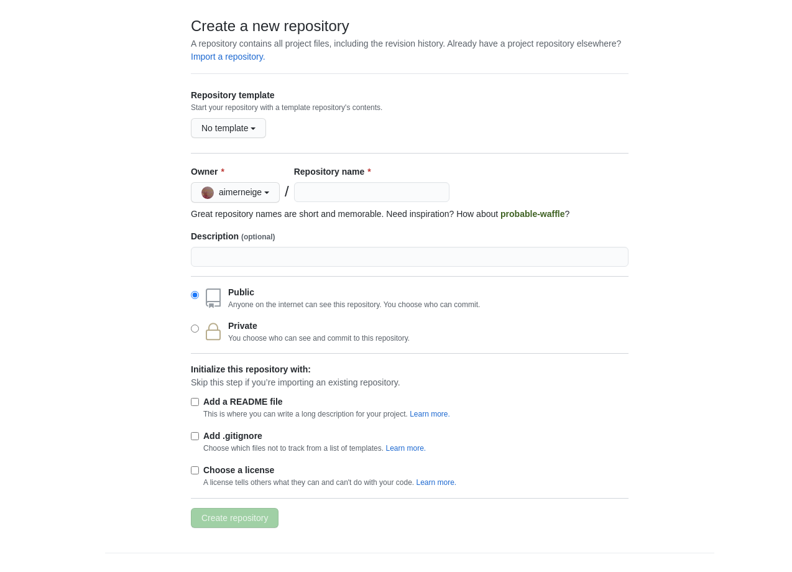
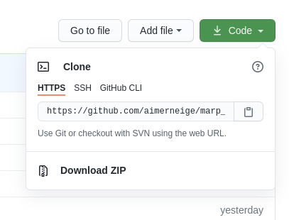

<!-- _class: lead -->

# **Android 实验室社团培训**

## Git & GitHub

---

<!-- _class: lead -->

> # Git 和 GitHub 是一个东西吗？

---


# 什么是 Git ？

> Git 是一个分布式的版本控制软件

# Git 有什么用呢 ？

> Git 可以记录你的修改历史，帮助你进行团队协作

---


# 什么是 GitHub ？

> GitHub 是通过 Git 进行版本控制的软件源代码托管服务平台

# GitHub 有什么用呢 ？

> 全球最大的代码托管平台，你可以**免费**地托管你的代码，获取 GitHub 安全可靠的云服务支持

> 全球最大的开源社区 <sub><sub>~~同性交友社区~~</sub></sub>

---

# Git 本质上是一个**软件**

# GitHub 本质上是一个**平台**

## 虽然它们之间关系紧密，但是请不要认为它们是一个东西

---

<!-- _class: lead -->

# Git 基本使用

---

# Git 的安装

### Git 官网： <https://git-scm.com/>

#### **Windows** 用户执行官网提供的安装包，按照默认的配置，直接狂按下一步就可以了。

#### **Linux** 用户使用包管理器安装。

#### **Mac** 用户建议使用 brew 安装。

---

# Git 命令

### Git 是一个**命令行软件** (Command Line Software)

### Git 没有图形化界面 (GUI)

### 一切工作都要在终端下完成

虽然在一些软件下，我们可以通过鼠标操作 GUI 的方式来执行 git 指令，但是这些软件本质上还是执行了 git 命令，这些软件有很多，操作也各不相同，但是它们的本质是一样的，了解了 git 再去操作这些辅助性质的软件也会很好上手。

---

# 如何打开 Git ？

### Git 没有界面，并不能打开，你可以通过打开终端模拟器来执行 Git 命令。

如果你是一个 Windows 用户，Windows 下的 Git 可能会自带一个 **Git GUI** 请不要使用它，使用 **Git Bash** 或其他终端模拟器。

---


---


---


# `git init`

#### 在当前目录下初始化一个新的 git 仓库

---


# `git status`

#### 查看当前仓库的状态

---


# `git add`

#### 将文件添加到暂存区以提交

```bash
git add <file>...
```

```bash
git rm --cached <file>...
```

---


# `git commit`

#### 进行一次提交

```bash
git commit -m "your message here"
```

---

<!-- _class: lead -->

# GitHub 基本使用

---

# GitHub 的注册

### GitHub 官网 <https://github.com/>

进入官网后选择 `Sign Up` 来注册一个账号

---

# 创建仓库

### 登陆后在主页点击绿色的 `New` 即可创建一个仓库

你可以对你的仓库进行一些配置，选择生成一些模板文件。

---



---



# Clone

clone 是将服务器上的仓库**复制**到本地

在仓库界面点击 `Code` 选择 HTTPS，点击复制，在终端执行如下 git 指令来 clone

```bash
git clone <url>
```

---

# Push

push 是将本地的修改**推送**到服务器

在本地做了修改后，使用 commit 提交这次更改，然后使用 push 指令将本地的提交推送到服务器。

```bash
git push
```

---

# Pull

pull 是将服务器的修改**拉取**到本地

与 push 相反，如果服务器存在本地没有的更改，就可以使用 pull 指令将服务器端的更改拉取到本地。

```bash
git pull
```

---

# Fork

fork 可以创建一个仓库的分支。

在仓库界面点击右上角 Fork，稍等片刻即可。

你只能 fork 别人的仓库，fork 后的仓库和原仓库完全相同，并且你拥有对仓库的所有权限，你可以进行，但是你的修改对原仓库没有任何影响。

---

# Pull Request

pull request 是合并请求，是指向发起一个请求请求将某一个分支仓库的某些修改合并到主仓库。

在仓库界面点击 Pull requests 然后点击绿色的 New pull request 即可发起一个 Pull Request

---


# Git & GitHub

本演示文档使用 [Marp](https://marp.app/) 构建

项目地址\
<https://github.com/AimerNeige/marp_git-github>

你可以尝试向这个仓库发送一个 pull request 来完善 README 以练习
