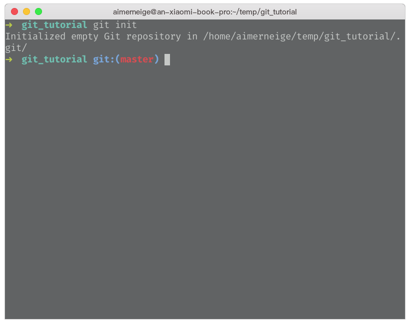

<!-- _class: lead -->

# **Android 实验室社团培训**

## Git & GitHub

---

<!-- _class: lead -->

> # Git 和 GitHub 是一个东西吗？

---


# 什么是 Git ？

> Git 是一个分布式的版本控制软件

# Git 有什么用呢 ？

> Git 可以记录你的修改历史，帮助你进行团队协作

---


# 什么是 GitHub ？

> GitHub 是通过 Git 进行版本控制的软件源代码托管服务平台

# GitHub 有什么用呢 ？

> 全球最大的代码托管平台，你可以**免费**地托管你的代码，获取 GitHub 安全可靠的云服务支持

> 全球最大的开源社区 <sub><sub>~~同性交友社区~~</sub></sub>

---

# Git 本质上是一个**软件**

# GitHub 本质上是一个**平台**

## 虽然它们之间关系紧密，但是请不要认为它们是一个东西

---

<!-- _class: lead -->

# Git 基本使用

---

# Git 的安装

### Git 官网： https://git-scm.com/

#### **Windows** 用户执行官网提供的安装包，按照默认的配置，直接狂按下一步就可以了。

#### **Linux** 用户使用包管理器安装。

#### **Mac** 用户建议使用 brew 安装。

---

# Git 命令

### Git 是一个**命令行软件** (Command Line Software)

### Git 没有图形化界面 (GUI)

### 一切工作都要在终端下完成

虽然在一些软件下，我们可以通过鼠标操作 GUI 的方式来执行 git 指令，但是这些软件本质上还是执行了 git 命令，这些软件有很多，操作也各不相同，但是它们的本质是一样的，了解了 git 再去操作这些辅助性质的软件也会很好上手。

---

# 如何打开 Git ？

### Git 没有界面，并不能打开，你可以通过打开终端模拟器来执行 Git 命令。

如果你是一个 Windows 用户，Windows 下的 Git 可能会自带一个 **Git GUI** 请不要使用它，使用 **Git Bash** 或其他终端模拟器。

---


---


---



# `git init`

#### 在当前目录下初始化一个新的 git 仓库

---


# `git status`

#### 查看当前仓库的状态

---


# `git add`

#### 将文件添加到暂存区以提交

```bash
git add <file>...
```

```bash
git rm --cached <file>...
```

---


# `git commit`

#### 进行一次提交

```bash
git commit -m "your message here"
```

---

<!-- _class: lead -->

# GitHub 基本使用

---


# Android Lab
